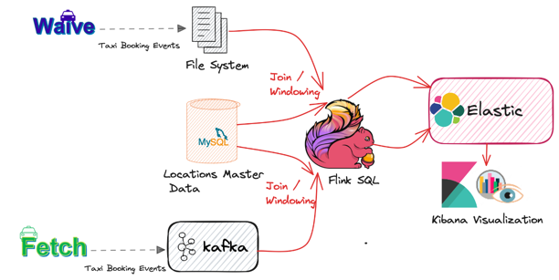
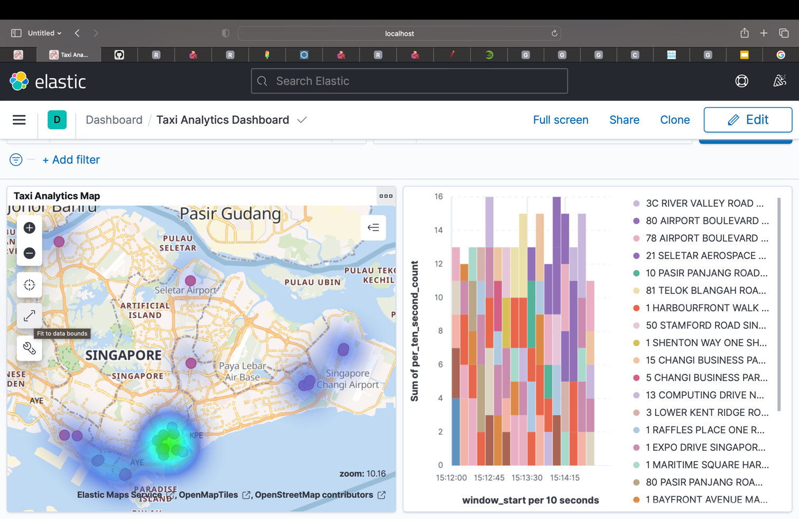

# Demo code for my talk on " Building Streaming Data Pipelines Using Flink SQL"

This repository has the demo code for building a real time analytics dashboard in Kibana by processing Taxi Booking 
Data from Kafka & File System and performing joins and windowing using Flink SQL

## Demo Outline



Waive & Fetch are imaginary ride hailing companies which emits Taxi Booking Events in JSON format. Fetch sends the
events to Kafka and Waive batches the events and writes to File System. A booking event will have fields such as rideId, pickupLocation, 
dropOffLocation, PickupDateTime etc. The events will be simulated using a Java program and we will have different 
themes to demonstrate the booking pattern for a regular day, a normal weekend, Friday evening, long weekend etc.

Refer to the Java code for the simulator in this [repo](https://github.com/Zabi82/flink-analytics-demo)

A sample message looks as follows

```

{
 "ride_id":"0fe1175c-ea99-4608-9efd-e219ff11ed20",
 "pickupDateTime":1704253351625,
 "pickupLocation":"78 AIRPORT BOULEVARD JEWEL CHANGI AIRPORT SINGAPORE 819666",
 "dropOffLocation":"50 STAMFORD ROAD SINGAPORE MANAGEMENT UNIVERSITY (LEE KONG CHIAN SCH OF BUSINESS) SINGAPORE 178899"
}

```
We will have a MySQL table which will have some Singapore Address dataset with details like the building name, 
postal code, geo coordinates etc in a table named "location" within a db "ride". Refer to init_sql_scripts.sql 
for the scripts. This data will be used to enrich the Taxi Riding Event to have details like Geo Coordinates. 

The demo is about how we can perform joining of raw events from Kafka, File System etc with data from MYSQL to get 
enriched events using Flink SQL as well as to perform some SQL like queries and windowing operations and send results
to Elastic to be able to visualize the results in Kibana in a cool dashboard.


## Demo Pre-Requisites

The demo is based on [docker-compose](https://docs.docker.com/compose/) environment

Docker compose setup will have containers for Kafka Broker, Zookeeper, Elastic Search, Kibana, MySQL, Flink Job Manager, 
Flink Task Manager, Flink SQL Shell. We also have a Dockerfile to download the some Connectors for Flink to connect 
with Kafka, Database etc which will be added to the Flink base image. 

The MySQL database will be initialized with sample address dataset using init_sql_scripts.sql. The flink-conf.yaml file
in the repo has configurations for task slots and checkpoints and mounted as a volume to have the Flink containers 
use them. The local directory "input" where the file system bound simulated messages will be stored will also be mounted 
as a volume inside the Flink containers. 

## Download and bring up the containers and start simulator

1) Make sure Docker Daemon is running
2) Checkout this repo. 
3) Rename the directory to flinksql
4) cd to the directory
5) Bring up the containers using the command ``` docker-compose up -d ```
6) Perform ``` docker ps ``` and make sure there are 8 containers up and running for the demo
7) Checkout the [repo](https://github.com/Zabi82/flink-analytics-demo) for simulating events. Refer to the README.md 
of the simulator repo for the pre-requisites. The simulation can be launched by running DataIngester.java which will
ingest messages to the running Kafka broker to a topic "taxi_ride" as well as batched events to File system under
$HOME/flinksql/input directory. You can modify this directory as needed in the simulator program
8) Verify if the events are being written to the kafka topic using command line or tools like OffSetExplorer. Also 
check if events are written to file system. 
9) Verify by launching a MySQL client to check data in the location table. Refer to the connection details of MySQL
from the docker-compose.yml file
10) Verify [Flink UI](http://localhost:8081/#/overview) from the browser and check the task slots and other details
11) Verify [Kibana UI](http://localhost:5601) from the browser

## Flink Demo Tasks

Launch the Flink SQL Shell by using below command

```

docker exec -it flinksql-sql-client-1 ./bin/sql-client.sh

```

Set the following properties for timezone and also to be able to see any query results in table form

```

SET 'table.local-time-zone' = 'UTC';

SET sql-client.execution.result-mode=tableau;

```

Create Flink Tables representing data from MySQL , Kafka and File System

Flink table representing the location master data from My SQL

```

CREATE TABLE SG_LOCATIONS_DB (
ID INT,
ADDRESS STRING,
BLK_NO STRING,
BUILDING STRING,
POSTAL_CODE STRING,
LATITUDE DECIMAL(9,6),
LONGITUDE DECIMAL(9,6),
ROAD_NAME STRING,
SEARCHVAL STRING,
PRIMARY KEY (ID) NOT ENFORCED
) WITH (
'connector' = 'jdbc',
'url' = 'jdbc:mysql://mysql:3306/ride',
'table-name' = 'location',
'username' = 'root',
'password' = 'root'
);

```

Flink Taxi Bookings table from Kafka topic taxi_ride

```

CREATE TABLE TAXI_BOOKINGS (
ride_id STRING,
pickupDateTime BIGINT,
pickupLocation STRING,
dropOffLocation STRING,
ts AS TO_TIMESTAMP_LTZ(pickupDateTime,3),
WATERMARK FOR ts AS ts - INTERVAL '5' SECOND  -- defines watermark on ts column, marks ts as event-time attribute
) WITH (
'connector' = 'kafka',
'topic' = 'taxi_ride',
'properties.bootstrap.servers' = 'broker:9092',
'properties.group.id' = 'group.taxi.ride',
'format' = 'json',
'scan.startup.mode' = 'earliest-offset',
'json.fail-on-missing-field' = 'true',
'json.ignore-parse-errors' = 'false'
);

```

Flink Taxi Bookings table from file system messages

```

CREATE TABLE
TAXI_BOOKINGS_FILES (
ride_id STRING,
pickupDateTime BIGINT,
pickupLocation STRING,
dropOffLocation STRING,
ts AS TO_TIMESTAMP_LTZ(pickupDateTime,3),
WATERMARK FOR ts AS ts - INTERVAL '5' SECOND  -- defines watermark on ts column, marks ts as event-time attribute

    ) WITH (
    'connector' = 'filesystem',
	'path' = 'file:/opt/flink/input',
	'format'='json',
	'json.fail-on-missing-field' = 'false',
	'json.map-null-key-mode' = 'DROP',
        'source.monitor-interval' = '100'
);

```

Make sure the tables are created without any errors. You can use command ``` show tables; ``` and should see 
the following 3 tables

* SG_LOCATIONS_DB 
* TAXI_BOOKINGS 
* TAXI_BOOKINGS_FILES 


### Tasks

#### Task 1 - Perform some regular SQL queries using Flink SQL like joins, count, union etc. on the Taxi Booking Event Data

Query for a particular postal code (take one sample emitted from the simulator) by joining the Flink table for Kafka 
with Flink table for MySQL and performing an union with similar join between Flink table from File System and MySQL

You can also perform a count query instead

```

Select * from 
( select 'FETCH' AS COMPANY, SLD.ADDRESS as ADDRESS, SLD.BUILDING, SLD.POSTAL_CODE as POSTAL_CODE, 
TB.pickupDateTime from TAXI_BOOKINGS TB INNER JOIN SG_LOCATIONS_DB SLD ON TB.dropOffLocation = SLD.ADDRESS 
union 
(select 'WAIVE' AS COMPANY, SLD.ADDRESS as ADDRESS, SLD.BUILDING, SLD.POSTAL_CODE as POSTAL_CODE, 
TF.pickupDateTime from  TAXI_BOOKINGS_FILES TF INNER JOIN SG_LOCATIONS_DB SLD ON TF.dropOffLocation = SLD.ADDRESS)
) 
WHERE POSTAL_CODE = '819642' ;

```
count query

```
Select count(*) from
( select 'FETCH' AS COMPANY, SLD.ADDRESS as ADDRESS, SLD.POSTAL_CODE as POSTAL_CODE, TB.pickupDateTime from 
TAXI_BOOKINGS TB INNER JOIN SG_LOCATIONS_DB SLD ON TB.dropOffLocation = SLD.ADDRESS  
union 
(select 'WAIVE' AS COMPANY, SLD.ADDRESS as ADDRESS, SLD.POSTAL_CODE as POSTAL_CODE, TF.pickupDateTime from  
TAXI_BOOKINGS_FILES TF INNER JOIN SG_LOCATIONS_DB SLD ON TF.dropOffLocation = SLD.ADDRESS)
) 
WHERE POSTAL_CODE = '819642'

```

These queries spins up tasks in Flink and this can be monitored in Flink UI. Use Ctrl + C to terminate the query

#### Task 2 - Enrich the Taxi Booking Event Data from Kafka as well as File System by joining them with the MySQL Data to get Geo Coordinates and send the result to ElasticSearch so that it can be visualized in an interactive Map

Create elastic search index to store enriched Taxi Booking Data with geopoint. Note that it's possible for Flink 
to auto create this but to precisely define the location attribute as "geo_point", we are explicitly creating the 
index. This should be done from [Dev Tools](http://localhost:5601/app/dev_tools#/console)


```
PUT taxi_ride_geo
{
    "mappings": {
        "properties" : {
            "address": {"type": "text"},
            "location": {"type": "geo_point"},
            "pickupDateTime" : {"type": "date", "format": "yyyy-MM-dd HH:mm:ss"}
        }
    }
}

```

Create Flink table to point to the elastic search index with geopoint created above. This should be done from Flink SQL Shell

```

CREATE TABLE TAXI_RIDE_GEO (
address STRING,
location DOUBLE ARRAY,
pickupDateTime STRING
) WITH (
'connector' = 'elasticsearch-7', -- using elasticsearch connector
'hosts' = 'http://elasticsearch:9200',  -- elasticsearch address
'index' = 'taxi_ride_geo'  -- elasticsearch index name, similar to database table name
);

```

Insert enriched events from Kafka to Elastic

```

INSERT INTO TAXI_RIDE_GEO
SELECT SLD.ADDRESS as address, ARRAY[SLD.LONGITUDE, SLD.LATITUDE] as location, 
DATE_FORMAT(FROM_UNIXTIME(TB.pickupDateTime / 1000), 'yyyy-MM-dd HH:mm:ss') as pickupDateTime 
from TAXI_BOOKINGS TB INNER JOIN SG_LOCATIONS_DB SLD ON TB.dropOffLocation = SLD.ADDRESS;

```

Insert enriched event from file system to Elastic

```

INSERT INTO TAXI_RIDE_GEO
SELECT SLD.ADDRESS as address, ARRAY[SLD.LONGITUDE, SLD.LATITUDE] as location, 
DATE_FORMAT(FROM_UNIXTIME(TB.pickupDateTime / 1000), 'yyyy-MM-dd HH:mm:ss') as pickupDateTime 
from TAXI_BOOKINGS_FILES TB INNER JOIN SG_LOCATIONS_DB SLD ON TB.dropOffLocation = SLD.ADDRESS;

```

#### Task 3 - Perform Windowing operations on the Taxi Booking Event Data from Kafka as well as File System to count the top drop off locations within that window and send the results to Elasticsearch to be able to visualize in Kibana

Create elastic search index to store the windowed operation's results. 
This should be done from [Dev Tools](http://localhost:5601/app/dev_tools#/console)

```

PUT ride_count_by_location_per_ten_second
{
    "mappings": {
        "properties" : {
            "drop_off_location": {
                "type": "text",
                "fields" : {
                    "keyword" : {
                        "type" : "keyword",
                        "ignore_above" : 256
                    }
                }
            },
            "window_start": {"type": "date", "format": "yyyy-MM-dd HH:mm:ss"},
            "window_end": {"type": "date", "format": "yyyy-MM-dd HH:mm:ss"},
            "per_ten_second_count" : {"type": "long"}
        }
    }
}

```

For visualizing the results of Task #2 and Task #3, import index patterns and dashboard objects in Elastic by using
the file export.ndjson in this project. This should be done from the [Kibana UI](http://localhost:5601/app/management/kibana/objects) 
and selecting import option and choosing the file export.ndjson which is part of this project. It should import 
3 object including 2 index patterns and 1 Dashboard

Create Flink table to point to elastic search index to store the tumbled window result

```

CREATE TABLE ride_count_by_location_per_ten_second (
drop_off_location STRING,
window_start TIMESTAMP,
window_end TIMESTAMP,
per_ten_second_count BIGINT
) WITH (
'connector' = 'elasticsearch-7', -- using elasticsearch connector
'hosts' = 'http://elasticsearch:9200',  -- elasticsearch address
'index' = 'ride_count_by_location_per_ten_second'  -- elasticsearch index name, similar to database table name
);

```

Insert tumbled window data for Kafka based events

```

INSERT INTO ride_count_by_location_per_ten_second
SELECT dropOffLocation, window_start, window_end, count(*) as count_per_window
FROM TABLE(
TUMBLE(TABLE TAXI_BOOKINGS, DESCRIPTOR(ts), INTERVAL '10' SECOND))
GROUP BY dropOffLocation, window_start, window_end;

```

Insert tumbled window data for file system based events

```

INSERT INTO ride_count_by_location_per_ten_second
SELECT dropOffLocation, window_start, window_end, count(*) as count_per_window
FROM TABLE(
TUMBLE(TABLE TAXI_BOOKINGS_FILES, DESCRIPTOR(ts), INTERVAL '10' SECOND))
GROUP BY dropOffLocation, window_start, window_end;

```
Now to visualize the results of Task #2 and Task #3, go to [Kibana Dashboards](http://localhost:5601/app/dashboards#/list?_g=(filters:!(),refreshInterval:(pause:!t,value:0),time:(from:now-3m,to:now)) ) 
and click on Taxi Analytics Dashboard. Click on Fit to Window on the map by clicking on "Fit to Data bounds" icon 
which is a slanted double headed arrow as showin in the image below.



Now you can stop the simulator (DataIngester) and re-run it with different themes from the LocationTheme Enum like
NORMAL_WEEKEND, LONG_WEEKEND, FRIDAY_EVENING. This can be updated in the DataIngester class. You can observe that 
the hotspots in the map change based on the different themes. 